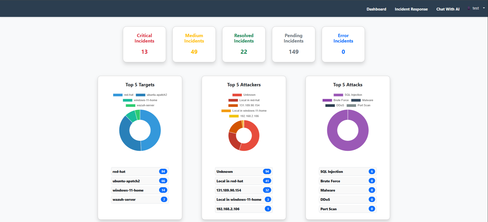

# Incident-Response-Platform

## Project Overview
The **Incident-Response-Platform** is a cybersecurity tool designed to handle security alerts efficiently. It consists of three main components:

1. **Django Web Application** – The main frontend and backend interface for managing incidents.
2. **Webhook** – Receives alerts from Wazuh and processes them.
3. **Database** – Stores alerts and incident responses for further analysis.

## Installation and Setup Guide

### 1. Install MySQL on a Linux Virtual Machine

**Connect to MySQL:**
```sh
mysql -u root
```

**Create a MySQL User:**
```sql
CREATE USER 'username'@'allowed_ip_address' IDENTIFIED BY 'YourVerySecretPassword';
```
> **Note:** Use `%` as a wildcard to allow connections from any IP address.

**Grant Privileges:**
```sql
GRANT ALL PRIVILEGES ON your_database_name.* TO 'username'@'allowed_ip_address';
```

**Apply Privileges:**
```sql
FLUSH PRIVILEGES;
```

---

### 2. Clone the Git Repository
```sh
git clone [REPOSITORY_URL]
```

---

### 3. Create a Virtual Environment
#### On Windows:
```sh
python3 -m venv venv
venv\Scripts\Activate
```
#### On Linux:
```sh
python3 -m venv venv
source venv/bin/activate
```

---

### 4. Install Dependencies
```sh
pip install django
pip install cryptography
pip install mysqlclient
pip install pymysql
python manage.py migrate
pip install python-dotenv
```

---

### 5. (Optional) Install AI Features
If you wish to use AI-based features, install **Ollama** and download the Mistral model.

**Download Ollama:** [Ollama Website](https://ollama.ai)

**Download Mistral 7B Model:**
```sh
ollama serve
```

---

### 6. Configure the Database
Modify the database settings in the project’s configuration file to match your MySQL setup.

---

### 7. Run Database Migrations
```sh
python manage.py migrate
```

---

### 8. Start the Application
```sh
python manage.py runserver
```

---

### 9. Create a Super Admin
Use the registration feature to create an admin account.

---

### 10. Manage Users
Allow users to register and access the platform.

---

## Project Screenshots

Here are the main interface screens of the project:





---

## Contributions
Feel free to submit pull requests or open issues for suggestions and improvements!

---

## License
This project is licensed under USTHB .

